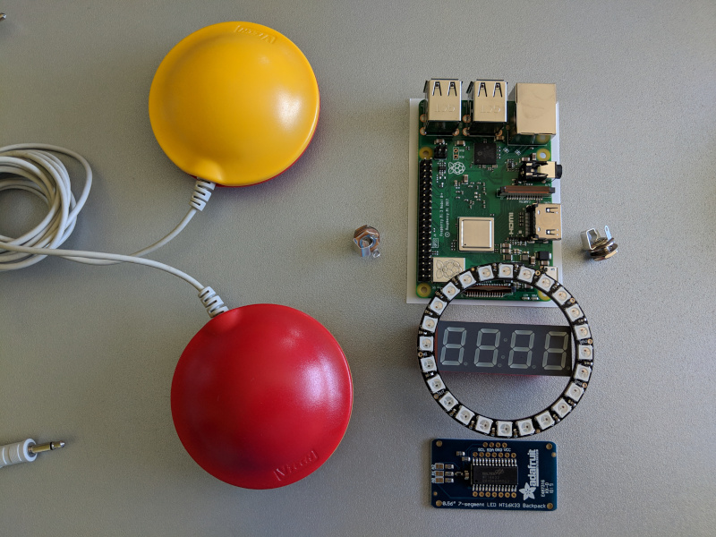

# BlindTest

BlindTest (WIP) Android Things project

## Hardware

### STM32 Nucleo L476RG

[datasheet](https://www.st.com/content/ccc/resource/technical/document/user_manual/98/2e/fa/4b/e0/82/43/b7/DM00105823.pdf/files/DM00105823.pdf/jcr:content/translations/en.DM00105823.pdf) see page 52

### Adafruit 7-Segment display

[product](https://www.adafruit.com/product/881)

[datasheet](https://cdn-shop.adafruit.com/datasheets/ht16K33v110.pdf)

### Adafruit 24 Leds Ring

[product](https://www.adafruit.com/product/1586)

[datasheet](https://cdn-shop.adafruit.com/product-files/1138/SK6812+LED+datasheet+.pdf)

